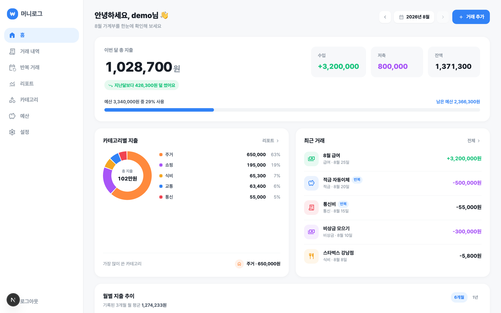
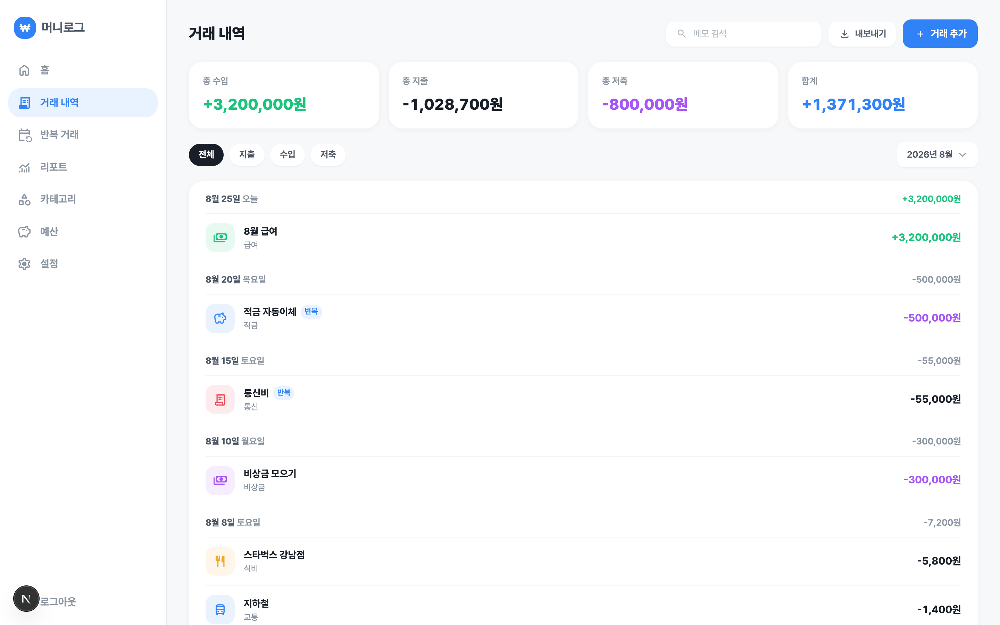
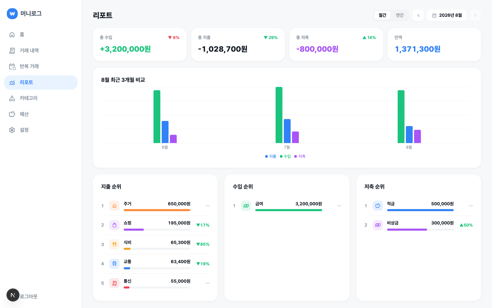

# 머니로그 (MoneyLog)

돈의 흐름이 한눈에 보이는 PC 전용 개인 가계부

**[라이브 데모](https://moneylog-chano.vercel.app)**

> 데모 계정 — `demo@example.com` / `demo1234`
> 자유롭게 둘러보세요.



## 기능

- **거래** — 입력·수정·삭제·복제, 월별 조회, 타입(지출/수입/저축)·카테고리 필터, 메모 검색, CSV 내보내기(월/전체)
- **저축** — 지출·수입과 구분되는 제3 거래 타입. 지출 통계에는 잡히지 않고 잔액(수입−지출−저축)에서만 차감
- **반복 거래** — 고정지출·정기수입을 규칙으로 등록하면 매달 방문 시 자동 생성. 생성된 거래를 지우면 그 달은 건너뛴 것으로 기록되어 되살아나지 않음
- **예산** — 카테고리별 월 예산 + 월 전체 한도(총예산), 지난달 예산 불러오기, 사용률 게이지
- **대시보드** — 총 지출과 전월 대비 증감, 예산 진행률, 카테고리 도넛, 최근 거래, 월별 추이
- **리포트** — 월간/연간 토글, 수입·지출·저축 통합 요약, 3계열 추이 차트, 타입별 카테고리 순위, 연간 월별 내역 표. 진행 중인 해는 전년 동기간과 비교
- **카테고리** — 타입별(지출/수입/저축) 관리, 아이콘·색 지정, 카테고리별 거래 바로가기
- **인증** — 로그인/회원가입, 비밀번호 재설정·변경

페이지를 이동해도 조회 중인 월이 유지되고, 로고를 누르면 이번 달로 돌아옵니다.

| 거래 내역 | 리포트 |
|---|---|
|  |  |

## 기술 스택

| 영역 | 사용 |
|---|---|
| 프레임워크 | Next.js 16 (App Router), React 19, TypeScript |
| 스타일 | Tailwind CSS v4, shadcn/ui (Radix) |
| 백엔드 | Supabase — PostgreSQL, Auth, RLS |
| 검증 · 차트 | Zod, Recharts, date-fns |
| 도구 | pnpm, Biome, Supabase CLI |

## 실행

```bash
pnpm install
cp .env.example .env.local   # 값 입력
pnpm dev
```

| 환경변수 | 설명 |
|---|---|
| `NEXT_PUBLIC_SUPABASE_URL` | Supabase 프로젝트 URL |
| `NEXT_PUBLIC_SUPABASE_PUBLISHABLE_KEY` | Supabase publishable(anon) 키 |
| `NEXT_PUBLIC_SITE_URL` | 앱 기본 URL (비밀번호 재설정 메일 링크에 사용) |

Supabase 대시보드 → Authentication → URL Configuration에 `{SITE_URL}/auth/callback`을 Redirect URL로 등록해야 재설정 메일이 동작합니다.

**스키마 반영**

```bash
pnpm supabase link --project-ref <ref>
pnpm supabase db push
pnpm gen:types
```

## 구조

```
src/
├── app/
│   ├── (auth)/          로그인 · 회원가입 · 비밀번호 재설정
│   ├── (main)/          대시보드 · 거래 · 반복 거래 · 리포트 · 카테고리 · 예산 · 설정
│   ├── api/export/      거래 CSV 다운로드
│   └── auth/callback/   Supabase 인증 콜백
├── components/
│   ├── ui/              shadcn/ui
│   ├── common/          도메인 무관 컴포넌트
│   └── <도메인>/         transactions, categories, budgets, recurring, dashboard, reports
├── lib/
│   ├── actions/         Server Action (쓰기)
│   ├── queries/         데이터 조회 (읽기)
│   ├── types.ts         DB 생성 타입 기반 도메인 타입
│   ├── schemas.ts       Zod 스키마
│   └── format.ts        포맷 · 날짜 정책
└── hooks/
```

DB 스키마는 `supabase/migrations`로 버전 관리하고, TypeScript 타입은 `supabase gen types`로 생성합니다.

## 설계 노트

- **RLS로 데이터 격리** — 사용자별 접근 제어를 앱 코드가 아닌 DB 정책에 두어, 쿼리를 어디서 호출하든 자기 데이터만 접근됩니다.
- **쓰기/읽기 분리** — 변경은 Server Action(`lib/actions`), 조회는 서버 컴포넌트에서 호출하는 `lib/queries`로 분리해 데이터 흐름을 단방향으로 유지합니다.
- **집계는 DB에서** — 월별 합계(`monthly_totals`)와 기간 카테고리 합계(`category_totals`)는 Postgres 함수로 집계합니다. SECURITY INVOKER로 실행되어 RLS가 그대로 적용되고, 연간 리포트도 거래 원본을 앱으로 가져오지 않습니다.
- **반복 거래의 멱등성** — 생성 여부는 거래가 아니라 별도 원장(`recurring_occurrences`, 규칙×월 UNIQUE)으로 판단합니다. 생성된 거래를 사용자가 삭제해도 원장이 남아 재방문 시 부활하지 않고, 동시 요청 경쟁은 UNIQUE 제약이 심판합니다.
- **월은 URL이 진실** — 조회 중인 월·기간·필터를 searchParams에 두어 새로고침·공유·뒤로가기에 상태가 살아남습니다. 사이드바가 월 파라미터를 이어 나르고, 필터 변경은 트랜지션으로 처리해 화면 교체 없이 갱신됩니다.
